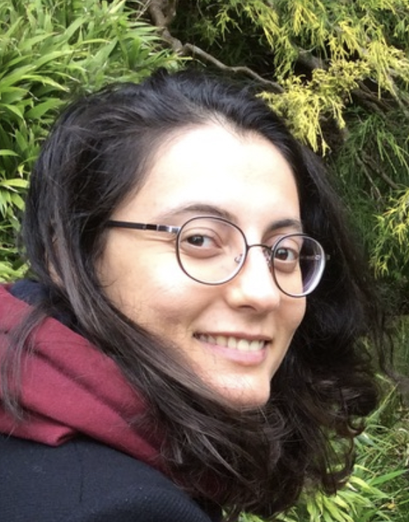

<br>

<style>
body {
text-align: justify}
</style>
```{r setup, include=FALSE}
knitr::opts_chunk$set(echo = TRUE)
```
<div style= "float:right;position: relative; top: -20px;">

</div>

<p style="color:black"><p style="color:black">I am a postdoctoral researcher at Bilkent University (in Ankara, Turkey). I received my Ph.D. in International Relations and Political Science from Koç University (in Istanbul, Turkey). I held a predoctoral fellowship (2019-2020) at the University of Illinois at Urbana-Champaign in the Department of Political Science.</p>

<br>

<p style="color:black"><p style="color:black">Advanced multivariate regression modeling (including ordinary least squares and fixed-effect analyses, structural equation modeling, event history and survival analysis, and state-of-the-art quasi-experimental designs such as propensity score matching, instrumental variable estimator, the difference-in-differences approach, and lagged dependent variable models) and inter-state and intra-state conflicts are my main areas of expertise. I have practical experience in qualitative research methods, particularly in concept formation and typological theory. I am proficient in both Stata and R. I am also fluent in geospatial programs (e.g., QGIS and ArcGIS).</p>

<br>

<p style="color:black">I am currently working for the Scientific and Technological Research Council of Turkey (TÜBİTAK) 2247D project titled "Citizen-Centered Counter-terrorism Strategies and Their Effectiveness." My postdoctoral job responsibilities include assistance to my research team in creating the cross-sectional time-series country-level data on state - armed group relationship and fielding, analyzing, and reporting the focus groups and nationally representative survey and global expert survey about counter-terrorism strategies.  </p> 

<br>

<p style="color:black">Prior to that, as a doctoral graduate student at Koç University, I gained experience in various research approaches. Under the supervision of Associate Prof. Reşat Bayer (Koç University), I (i) collected an original cross-national time-series country-level data on state of emergency declarations’ reasons, practices and outcomes, (ii) estimated developmental rates of provinces and counties in Turkey between 1993 and 2013 by using geo-spatial analysis of night lights estimation, (iii) re-coded the Global Terrorism Database’s overall absent year 1993 for Turkey, and (iv) brought together natural disaster and shocks data between 2007 and 2011 in Turkey. Under the supervision of Associate Prof. Belgin San-Akca (Koç University), I assisted the data collection and coding on cooperation between states and non-state armed groups. Under the supervision of Associate Prof. Arzu Kıbrıs (Sabancı University & University of Warwick), I collected and coded data on human rights violations by state and PKK at the province and county levels during the 1990s in Turkey. Lastly, I became familiar with the text-as-data research in social sciences by working as one of the annotators of the European Research Council (ERC) funded project named "Emerging Markets Welfare" at Koç University between October 2021 and August 2022.	I annotated randomly sampled Tweets in Turkish for mapping the mass Turkish ideological space under the supervision of Assoc. Prof. Erdem Yörük.
</p>


